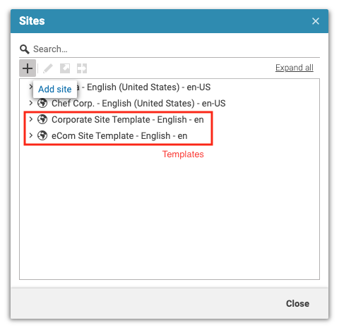
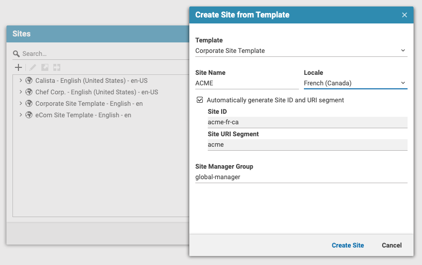
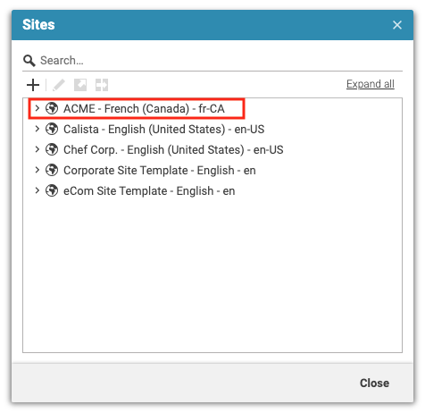

# Editorial Quick Start

--------------------------------------------------------------------------------

\[[Up](../README.md)\] 
--------------------------------------------------------------------------------

## Introduction

This guide assumes that you are familiar with CoreMedia Studio and that you are familiar with the sites concept of the _CoreMedia Blueprint_.

### Create new sites
The plugin adds an _Add site_ button to the sites window in CoreMedia Studio.

In the dialog, users can choose from the configured template sites and provide a desired site name and locale for the new site. In addition, the users can manually define a site id and uri segment and enter the site manager group.

The workflow will create the new site by copying the template site with the desired locale.

### How to create a template site?

Template sites can be created like all other sites.  To make a site appear in the template selector, the site id needs to be prefixed with `template-`. That's it.
