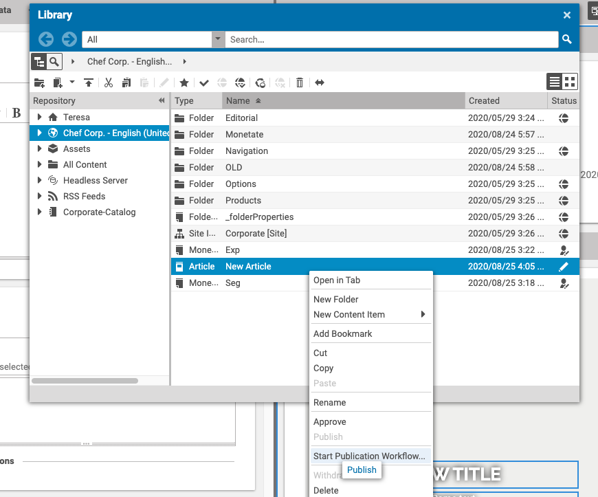
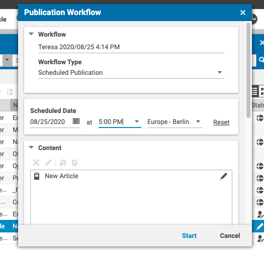
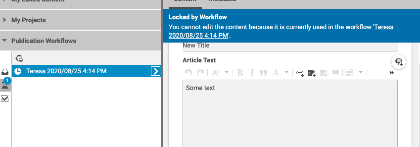
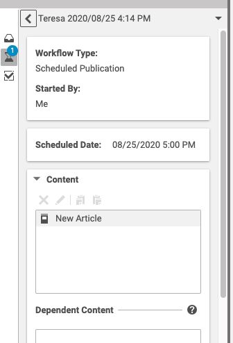
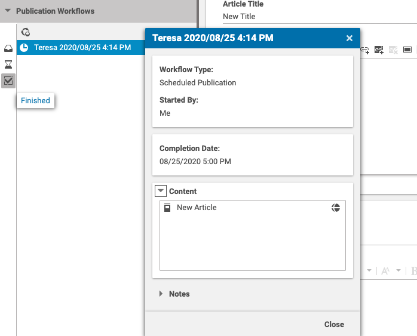

# Editorial Quick Start

--------------------------------------------------------------------------------

\[[Up](README.md)\] 
--------------------------------------------------------------------------------

## Introduction

This guide assumes that you are familiar with the CoreMedia Studio and that you have created a
new article, which should be published at a certain time in the future. The following instructions show how this task can be accomplished
by means of the publication workflow extensions.

### Start the Workflow

After having completed a new article, you can start publication workflows using 
the context menu on the document in the library, as shown here:

### Schedule the Publication

Choose _Scheduled Publication_ from the _Workflow Type_ dropdown, and select the
_Scheduled Date_. Click on _Start_ to start the workflow instance.

### Monitor the Scheduled Publication

While the scheduled publication is still pending, it is listed under the pending workflows.
A scheduled publication workflow instance will have the specific timer icon.
Notice that as long as it is pending, the document is locked so that it cannot be edited.

By clicking on the workflow instance, you will get the details of the workflow. Most importantly, you can see the scheduled date of the publication.

### Completion of the Scheduled Publication

When the scheduled date of the publication expires, the document will be automatically
published. The workflow instance is no longer pending and is now listed under the finished workflows:

Notice that the document is no longer locked and can be edited.

Well done. The document is now published!
