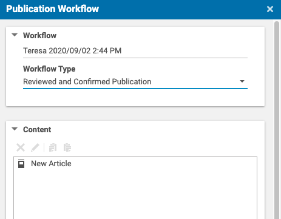
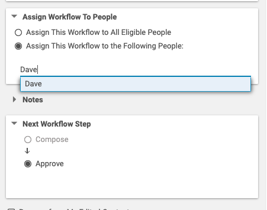
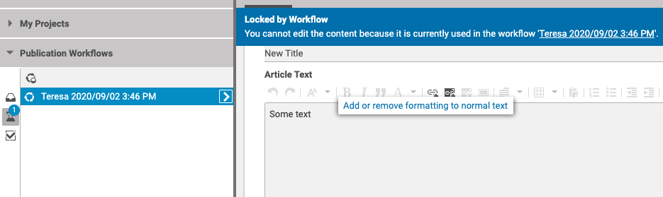
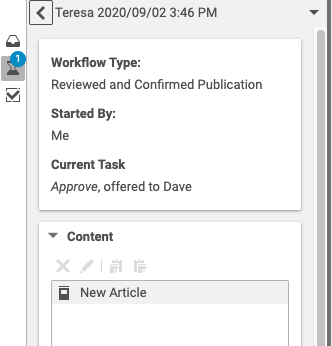
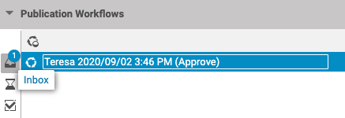
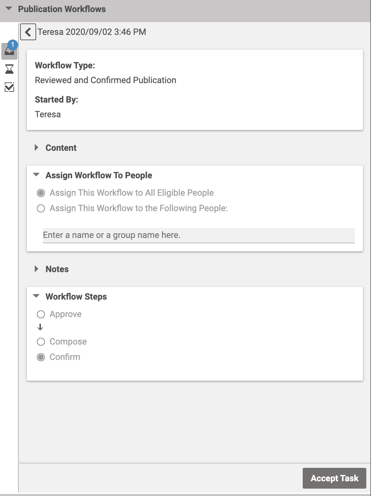
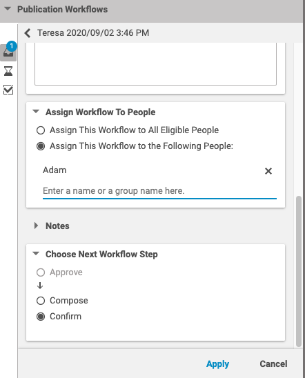
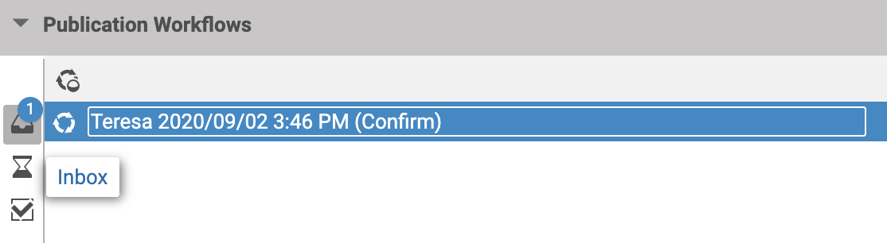
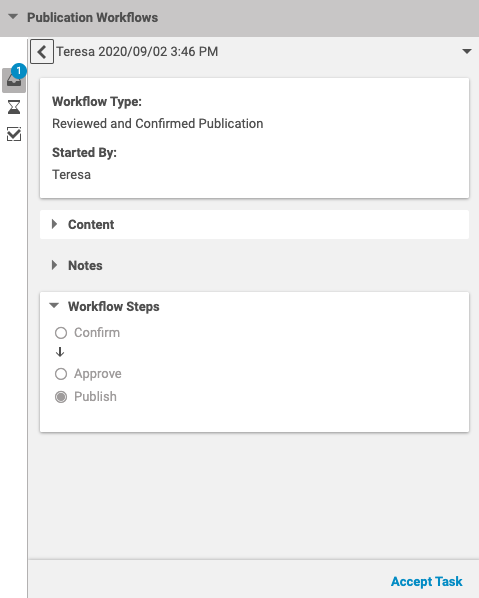
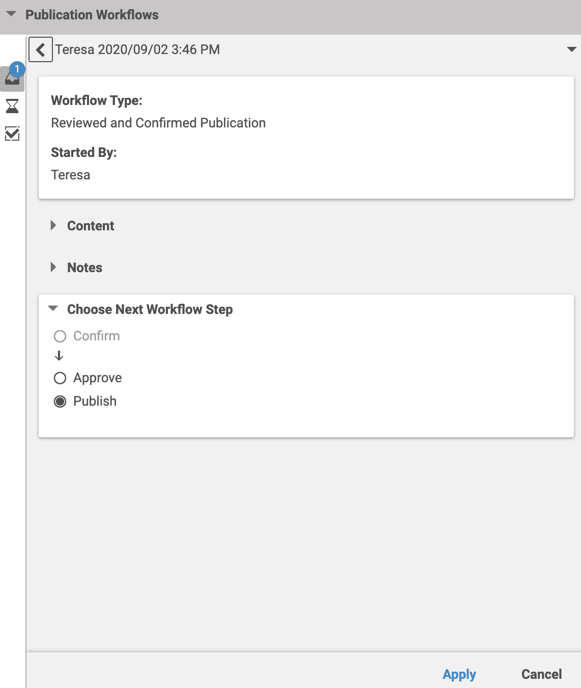

# Editorial Quick Start

--------------------------------------------------------------------------------

\[[Up](../README.md)\] 
--------------------------------------------------------------------------------

## Introducing

Assuming you are familiar with the CoreMedia Studio and that you created a
new article which should be sent to another editor for review who will then forward it 
to publication to a third editor. This guide shows how this task can be accomplished
by means of the three-step publication workflow extensions.

### Start the Workflow

After having completed a new article you can start publication workflows using 
the context menu on the document as shown here:

### Start the Three Step Publication Workflow

Choose the _Reviewed and Confirmed Publication_ from the list of _Workflow Type_

### Assign Workflow To People

Assign the task of approving the document to another editors by simply selecting 
the option _All Eligible People_ or specifying one or more editors:  

Click on _Start_ to start the workflow instance.

### Monitor the Three-Step Publication

While the three-step publication is yet pending it is listed under the pending workflows.
Notice that as long as it is pending the document is locked so that it cannot be edited.

By clicking on the workflow instance you get the details of the workflow. Especially
you can see the editors the workflow instance is assigned to.

### Approve Step of the Three-Step Publication

To editors who the workflow instance is assigned to - _Dave_ in this example - 
it is now listed under the inbox of workflows. Note that the instance's title contains
_Approve_ as the task to be performed.

By clicking on the workflow instance you get the details of the workflow, that is,
who has started the workflow and which document is to be reviewed.
Accept the task when you are ready to review and approve the document. 

You can now review the document. When everything is fine select _Confirm_ as 
next workflow step and assign the task to yet another editor like _Adam_ in this example.

Click on _Apply_ then the workflow instance moves from the inbox to the pending.

### Publish Step of the Three-Step Publication

To editors who the workflow instance is assigned to - _Adam_ in this example - 
it is now listed under the inbox of workflows. Note that the instance's title contains
_Confirm_ as the task to be performed.

By clicking on the workflow instance you get the details of the workflow, that is,
who has started the workflow and which document is to be published.
Accept the task when you are ready to review and publish the document. 

When everything is fine, and the document can be published, make sure the next workflow step is 
_Publish_ and click on _Apply_ to publish the document.

Well done. The document is now published!
